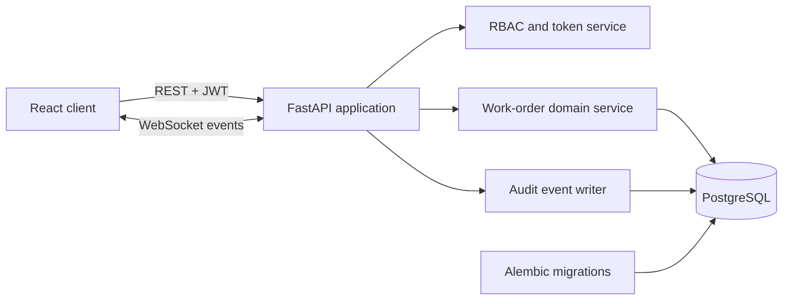
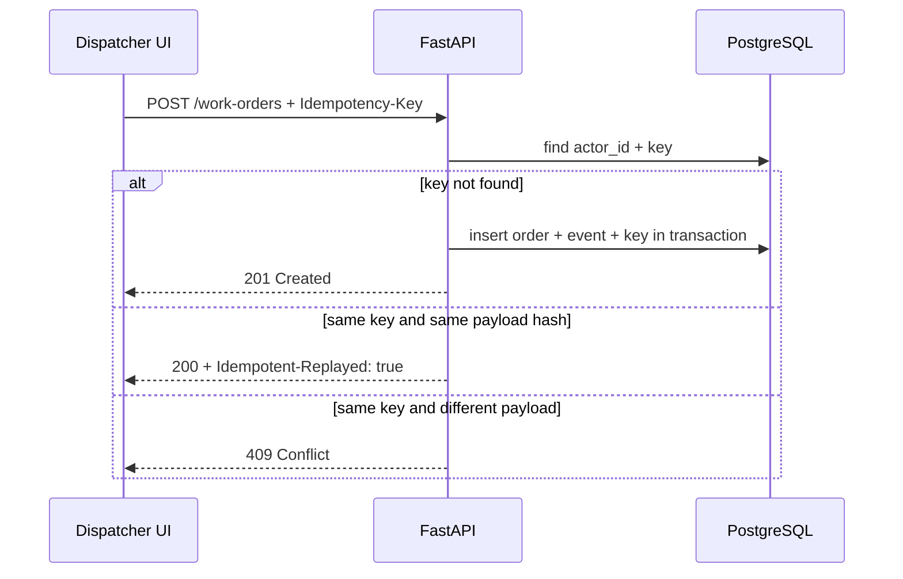
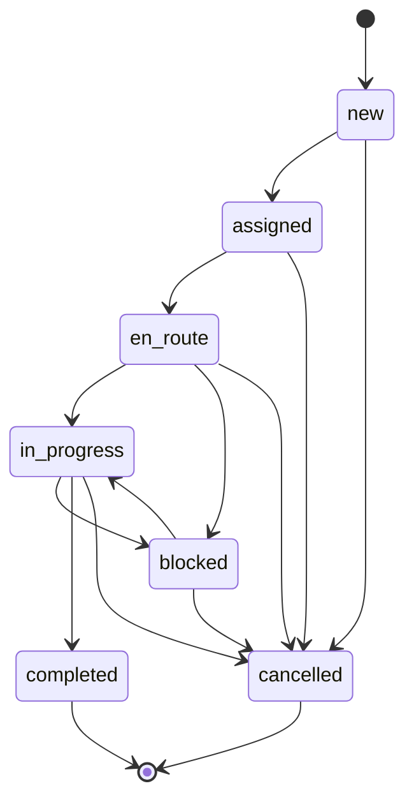

# FieldOps Cloud — архитектура

## Контекст

FieldOps Cloud моделирует работу сервисной компании: диспетчер создаёт заявку,
назначает техника и отслеживает выполнение, а техник видит только свои задачи.
Критичные свойства домена — предсказуемые переходы статусов, контроль SLA,
устойчивость к повторной отправке формы и защита от потери параллельных правок.

## Компоненты

Backend остаётся модульным монолитом. Для данного объёма это уменьшает
операционную сложность, но границы `auth`, `work orders`, `dashboard` и
`realtime` уже выделены и могут развиваться независимо.

## Запись с защитой от повторов

Ключ ограничен пользователем, а SHA-256 вычисляется от канонического JSON.
Запись заявки, audit event и idempotency record происходит в одной транзакции.

## Конкурентные обновления

Клиент отправляет ожидаемое поле `version`. API захватывает строку через
`SELECT ... FOR UPDATE`, сравнивает версию и только затем применяет переход.
Успешное изменение увеличивает `version`. Устаревший клиент получает `409` с
`current_version`, обновляет кеш и не перезаписывает чужое действие.

## Машина состояний

Переход `blocked` требует причины. Техник может двигать назначенную ему заявку
по рабочему маршруту, а операции диспетчеризации защищены отдельной зависимостью
RBAC.

## Realtime-модель

После фиксации транзакции API публикует компактное событие WebSocket. Клиент не
пытается вручную патчить сложные агрегаты: он инвалидирует соответствующие
TanStack Query keys и получает авторитетное состояние из REST API. Это проще и
надёжнее для B2B-интерфейса с умеренной частотой событий.

Текущий connection manager хранится в памяти одного процесса. В горизонтально
масштабируемой версии его следует заменить pub/sub-слоем (например, Redis или
RabbitMQ) и ограничить срок жизни WebSocket-токена.

## Данные и индексы

- уникальные email пользователей, коды площадок и номера заявок;
- уникальность `(actor_id, key)` для идемпотентности;
- индексы на status, priority, scheduled/SLA timestamps и внешние ключи;
- audit event хранит переход, автора, причину и JSON payload.

## Наблюдаемость и production hardening

Для промышленного развёртывания следующими шагами будут structured logging с
correlation ID, Prometheus-метрики, distributed tracing, внешний secret manager,
rate limiting login-маршрута, ротация refresh tokens и брокер для fan-out
realtime-событий.
